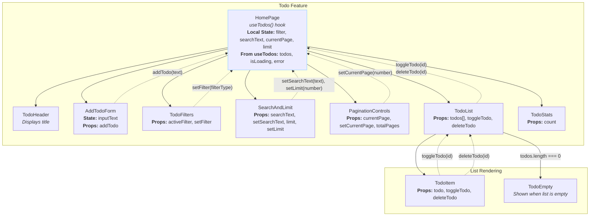

# React To-Do List Application

## Tech Stack

-   [React](https://react.dev/)
-   [Axios](https://axios-http.com/docs/intro) (for HTTP requests to the API)
-   [TailwindCSS](https://tailwindcss.com/) (for styling)

## Design Patterns Used

### Core Patterns

-   **Custom Hook Pattern**: The central pattern of the project. The `useTodos` hook encapsulates all state logic and data interaction — fetching tasks, managing loading and errors, and providing functions to add, update, and delete tasks. The `HomePage` component uses `useTodos()` while managing its own UI-specific states (filter, search text, pagination).
-   **Service Layer Pattern**: The API logic is isolated in asynchronous functions (`fetchTodosAPI`, `updateTodoAPI`, `deleteTodoAPI`) inside `useTodos.js`. This decouples business logic from the HTTP client (Axios), improving modularity.
-   **Container/Presentational Pattern**: Clear separation between "smart" container `HomePage` managing state and "dumb" presentational components (`TodoItem`, `TodoHeader`, `TodoFilters`, `AddTodoForm`, `SearchAndLimit`, `PaginationControls`) receiving data and callbacks as props.
-   **Unidirectional Data Flow**: State flows top-down via props; updates flow bottom-up via callbacks.

### Feature-Specific Patterns

-   **Optimistic UI Updates**: Immediate local state updates in `toggleTodo` and `deleteTodo` within `useTodos` for responsive UI, with rollback on server error.
-   **Conditional Rendering**: `TodoList` renders `TodoEmpty` if tasks array is empty. `HomePage` conditionally shows loading and error messages.
-   **State Colocation**: Global server state (`todos`, `isLoading`, `error`) managed by `useTodos` and passed to `HomePage`. UI-specific states like `filter`, `searchText`, `pagination`, and input control are local to components.

## Component Tree \& Data Flow

### Diagram

### State Management Overview

**useTodos Hook (Data Layer)**

-   `todos` — array of task objects
-   `isLoading` — loading status
-   `error` — error messages
-   Functions: `addTodo`, `toggleTodo`, `deleteTodo`

**HomePage Component (UI Layer)**

-   `filter` — task filter ('all', 'active', 'done')
-   `searchText` — search input state to filter task text
-   `currentPage`, `limit` — pagination state controlling current page and tasks per page

This architecture isolates data management in the hook while UI-specific states remain local for performance.

### Diagram Explanation

-   **App**: Root component rendering layout and `HomePage`.
-   **HomePage**: Smart container component using `useTodos()`; manages local UI states for filtering, searching, and pagination; passes data and callback props to child components.
-   **AddTodoForm**: Controlled component receiving `addTodo` callback to add new tasks.
-   **TodoFilters**: Receives and updates filter state.
-   **SearchAndLimit**: Controls search text and visible item limit.
-   **PaginationControls**: Controls pagination page.
-   **TodoList**: Conditionally renders empty state or task list.
-   **TodoItem**: Individual task item with toggle and delete handlers.
