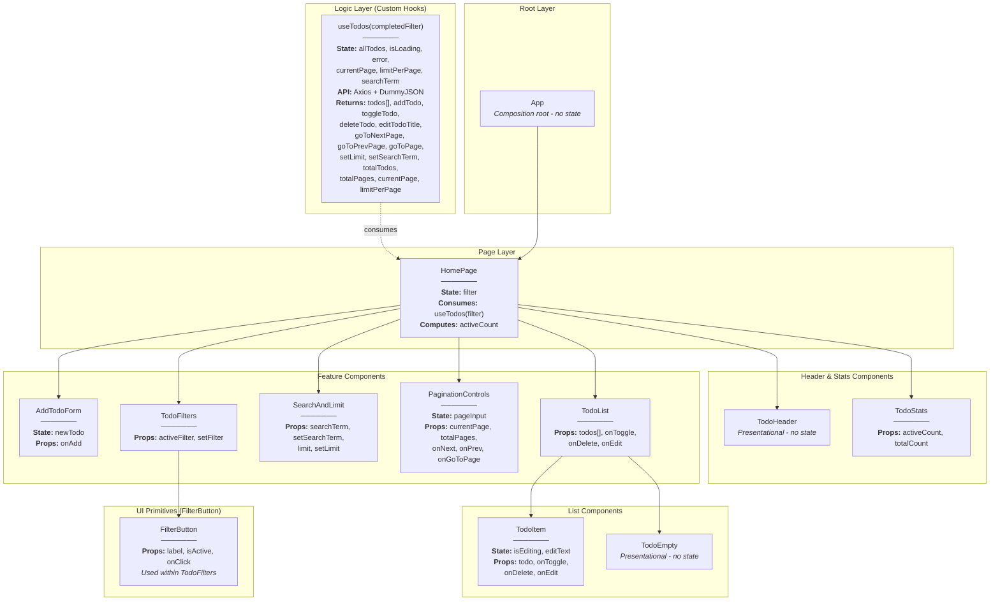

# React To-Do List Application

## Tech Stack

-   [React](https://react.dev/)
-   [Axios](https://axios-http.com/docs/intro) (for HTTP requests to the API)
-   [TailwindCSS](https://tailwindcss.com/) (for styling)

## Key Features

-   **Add, Edit, Delete Tasks**: Full CRUD operations with optimistic UI updates
-   **Task Filtering**: Filter tasks by status (All, Active, Done)
-   **Search Functionality**: Real-time search through task titles
-   **Pagination**: Navigate through tasks with customizable items per page
-   **Inline Editing**: Double-click or click Edit button to modify task titles
-   **Task Statistics**: Display active and total task counts
-   **Responsive Design**: Mobile-friendly interface built with Tailwind CSS
-   **Empty State**: User-friendly message when no tasks match filters

## Design Patterns Used

### Core Patterns

-   **Custom Hook Pattern**: The `useTodos` hook encapsulates all state logic including data fetching, filtering, pagination, and CRUD operations. Returns todos, loading state, error state, and handlers for add/toggle/delete/edit operations.
-   **Service Layer Pattern**: API logic is isolated in async functions inside `useTodos.js` using Axios for HTTP requests. Supports optimistic updates with rollback on error.
-   **Container/Presentational Pattern**: Clear separation between "smart" container `HomePage` managing state and "dumb" presentational components receiving data and callbacks via props.
-   **Unidirectional Data Flow**: State flows top-down through props; updates flow bottom-up via callbacks.

### Feature-Specific Patterns

-   **Optimistic UI Updates**: Immediate local state updates in `toggleTodo`, `deleteTodo`, and `editTodoTitle` with automatic rollback on server errors.
-   **Conditional Rendering**: `TodoList` renders `TodoEmpty` when tasks array is empty. `HomePage` conditionally displays loading and error messages.
-   **State Colocation**: Global server state (`allTodos`, `isLoading`, `error`) managed by `useTodos`. UI-specific states (filter, pagination, search) kept local to components or returned from hook.
-   **Memoization**: `useMemo` optimizes filtering and pagination computations to prevent unnecessary recalculations.
-   **Controlled Components**: Form inputs in `AddTodoForm`, `SearchAndLimit`, `PaginationControls`, and `TodoItem` (edit mode) maintain their own controlled state.

## Component Tree \& Data Flow

### Diagram

### State Management Overview

**useTodos Hook (Data Layer)**

-   `allTodos` — complete array of all tasks fetched from API
-   `isLoading` — loading status during initial fetch
-   `error` — error messages from API operations
-   `currentPage` — current pagination page number
-   `limitPerPage` — number of tasks displayed per page
-   `searchTerm` — current search query text
-   **Computed values**: `filteredTodos` (filtered by search + status), `paginatedTodos` (current page slice), `totalTodos`, `totalPages`
-   **Functions**: `addTodo`, `toggleTodo`, `deleteTodo`, `editTodoTitle`, `goToNextPage`, `goToPrevPage`, `goToPage`, `setLimit`, `setSearchTerm`

**HomePage Component (UI Layer)**

-   `filter` — task filter state ('all', 'active', 'done')
-   Consumes `useTodos(filter)` hook and passes data/handlers to child components
-   Calculates `activeCount` for statistics display

**TodoItem Component (Local UI State)**

-   `isEditing` — toggles between view and edit mode
-   `editText` — controlled input for editing task title

**PaginationControls Component (Local UI State)**

-   `pageInput` — controlled input for jump-to-page functionality

### Diagram Explanation

-   **App**: Root component rendering layout and `HomePage`.
-   **HomePage**: Smart container using `useTodos()` hook; manages filter state and passes data/callbacks to presentational components.
-   **AddTodoForm**: Controlled form component with local `newTodo` state; calls `onAdd` prop to add new tasks (inserted at start of list).
-   **TodoFilters**: Three filter buttons (All, Active, Done) to control task visibility.
-   **SearchAndLimit**: Combined search input and limit selector for filtering and pagination control.
-   **PaginationControls**: Navigation controls with Prev/Next buttons and jump-to-page input field.
-   **TodoList**: Renders either `TodoEmpty` or list of `TodoItem` components.
-   **TodoItem**: Individual task with toggle checkbox, inline edit mode (double-click or Edit button), and delete button.
-   **TodoStats**: Displays active and total task counts.
-   **TodoHeader**: Simple header component with application title.
-   **TodoEmpty**: Empty state component shown when no tasks match current filters.

## API Integration

The application integrates with **DummyJSON API** for todo operations:

-   **GET** `https://dummyjson.com/todos?limit=0` — Fetch all todos on initial load
-   **PUT** `https://dummyjson.com/todos/:id` — Update todo (toggle completion or edit title)
-   **DELETE** `https://dummyjson.com/todos/:id` — Delete todo

Local-only todos (identified by timestamp IDs) skip server requests and update only client state.

## Advanced Features

### Client-Side Filtering \& Pagination

All data fetching happens once on mount. Filtering (by status and search term) and pagination are computed **client-side** using `useMemo` for performance optimization.

### Optimistic Updates with Rollback

Tasks update immediately in the UI before API calls complete. If API requests fail, the hook automatically reverts changes and displays error messages.

### Inline Editing

Tasks can be edited inline by clicking the Edit button or double-clicking the task text. Changes are saved on Enter key or Save button click, with Cancel option to discard edits.

### Dynamic Pagination Reset

Changing search terms or filters automatically resets to page 1 to prevent empty page views.
