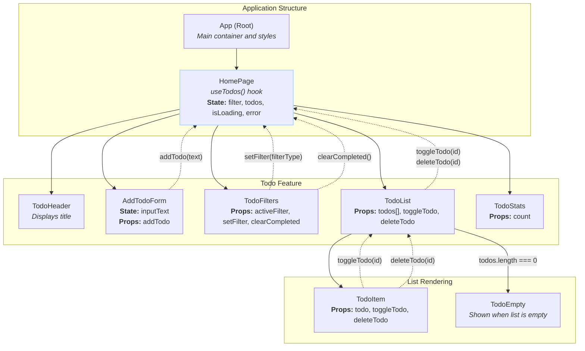

# React To-Do List Application

This project is an implementation of a classic "To-Do List" application, created as part of a React course. It demonstrates modern development approaches, including the use of custom hooks, interaction with a REST API, and a component-based architecture.

## Tech Stack

- [React](https://react.dev/)
- [Axios](https://axios-http.com/docs/intro) (for HTTP requests to the API)
- [TailwindCSS](https://tailwindcss.com/) (for styling)

### Used Design Patterns

#### Core Patterns

- **Custom Hook Pattern**: This is the central pattern of the project. The `useTodos` hook encapsulates all state logic and data interaction: fetching tasks, loading status, error handling, as well as functions for adding, updating, and deleting tasks. The `HomePage` component simply calls `useTodos()` to get all the necessary data and functions, abstracting away the implementation details.
- **Service Layer Pattern**: The API communication logic is isolated into separate asynchronous functions (`fetchTodosAPI`, `updateTodoAPI`, `deleteTodoAPI`) within the `useTodos.js` file. These functions act as a "service layer" that handles all interactions with the external API. This decouples the application's business logic from the specific HTTP client (Axios), making the code more modular and easier to maintain.
- **Container/Presentational Pattern**: The project clearly separates "smart" components that manage state and logic from "dumb" components that only display data.
    - **`HomePage.jsx`** is the "smart" container. It fetches data using `useTodos`, manages filter state, and holds all handler functions.
    - **`TodoItem`, `TodoHeader`, `TodoFilters`, `AddTodoForm`** are presentational components. They receive data and functions via `props` and are not concerned with where the data comes from.
- **Unidirectional Data Flow**: State flows "top-down" from parent to child components via `props` (e.g., from `HomePage` to `TodoList`). Changes are communicated "bottom-up" via callback functions (e.g., `deleteTodo` from `TodoItem` to `HomePage`).

#### Feature-Specific Patterns

- **Optimistic UI Updates**: In the `useTodos` hook, the `toggleTodo` and `deleteTodo` functions immediately update the local state (UI) before the server has responded. This makes the interface feel extremely fast and responsive. A `try...catch` block serves as a safety net to roll back the changes if the server request fails.
- **Conditional Rendering**: The `TodoList` component renders the `TodoEmpty` component only when the `todos` array is empty. Also, `HomePage` conditionally displays loading (`Loading...`) and error (`Error...`) messages.
- **State Colocation**: The global server state (`todos`) is managed by the `useTodos` hook and lifted to the `HomePage` component. Meanwhile, UI-specific state, such as the text in the `AddTodoForm`, remains local to that component, preventing unnecessary re-renders of the entire application.

### Component Tree \& Data Flow

#### Diagram

#### Diagram Explained

- **App**: The root component. It renders the main layout and the primary `HomePage`.
- **HomePage**:
    - This is the main "smart" component (container).
    - It calls the `useTodos()` custom hook to get the `todos` array, `isLoading`/`error` states, and action functions (`addTodo`, `toggleTodo`, `deleteTodo`).
    - It manages the local filter state ('all', 'active', 'done').
    - **Data Down**: It passes `addTodo` to `AddTodoForm`.
    - **Data Down**: It passes the filtered `todos` array and the `toggleTodo`, `deleteTodo` functions to the `TodoList` component.
    - **Data Down**: It passes filter state and control functions (`activeFilter`, `setFilter`) to `TodoFilters`.
- **AddTodoForm**:
    - A "dumb" component that receives `addTodo` as a prop.
    - **Callback Up**: On form submission, it invokes `addTodo(newTodoText)`, sending the new task's content up to be handled by the `useTodos` hook.
- **TodoFilters**:
    - Receives the current filter and functions to change it.
    - **Callback Up**: Invokes `setFilter(filterType)` when a filter button is clicked.
- **TodoList**:
    - Receives the filtered `todos` array.
    - If the array is empty, it conditionally renders the `TodoEmpty` component.
    - Otherwise, it maps over the array and renders a `TodoItem` for each todo, passing down the `todo` object and the `onToggle` and `onDelete` callbacks.
- **TodoItem**:
    - Displays a single todo.
    - **Callback Up**: Invokes `toggleTodo(todo.id)` when its checkbox is clicked.
    - **Callback Up**: Invokes `deleteTodo(todo.id)` when its delete button is clicked.
