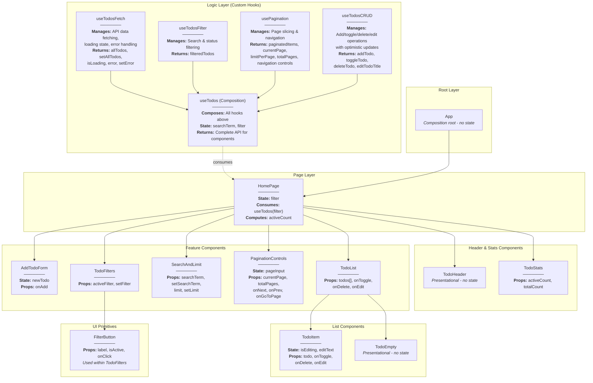

# React To-Do List Application

## Tech Stack

-   [React](https://react.dev/)
-   [Axios](https://axios-http.com/docs/intro) (for HTTP requests to the API)
-   [TailwindCSS](https://tailwindcss.com/) (for styling)

## Key Features

-   **Add, Edit, Delete Tasks**: Full CRUD operations with optimistic UI updates
-   **Task Filtering**: Filter tasks by status (All, Active, Done)
-   **Search Functionality**: Real-time search through task titles
-   **Pagination**: Navigate through tasks with customizable items per page
-   **Inline Editing**: Double-click or click Edit button to modify task titles
-   **Task Statistics**: Display active and total task counts
-   **Responsive Design**: Mobile-friendly interface built with Tailwind CSS
-   **Empty State**: User-friendly message when no tasks match filters

## Design Patterns Used

### Core Patterns

-   **Custom Hook Composition Pattern**: The application uses a modular hook architecture where specialized hooks are composed together to create complex functionality.
-   **Single Responsibility Principle**: Each custom hook handles one specific concern (data fetching, filtering, pagination, or CRUD operations), making the codebase more maintainable and testable.
-   **Service Layer Pattern**: API logic is isolated in `useTodosCRUD` hook using Axios for HTTP requests with optimistic updates and rollback on error.
-   **Container/Presentational Pattern**: Clear separation between "smart" container `HomePage` managing state and "dumb" presentational components receiving data and callbacks via props.
-   **Unidirectional Data Flow**: State flows top-down through props; updates flow bottom-up via callbacks.

### Feature-Specific Patterns

-   **Optimistic UI Updates**: Immediate local state updates in `useTodosCRUD` operations (`toggleTodo`, `deleteTodo`, `editTodoTitle`) with automatic rollback on server errors.
-   **Conditional Rendering**: `TodoList` renders `TodoEmpty` when tasks array is empty; `HomePage` conditionally displays loading and error messages.
-   **State Colocation**: Global server state (`allTodos`, `isLoading`, `error`) managed by `useTodosFetch`; UI-specific states (filter, pagination, search) kept local to components or returned from specialized hooks.
-   **Memoization**: `useMemo` optimizes filtering and pagination computations to prevent unnecessary recalculations.
-   **Controlled Components**: Form inputs in `AddTodoForm`, `SearchAndLimit`, `PaginationControls`, and `TodoItem` (edit mode) maintain their own controlled state.

## Hook Architecture

The application follows a modular hook architecture with four specialized hooks composed into one main hook :

### useTodosFetch

Manages data fetching and initial loading state.

**Responsibilities:**

-   Fetches all todos from API on mount
-   Manages loading and error states during fetch operations
-   Provides `allTodos` array and setters for state updates

**Returns:** `{ allTodos, setAllTodos, isLoading, error, setError }`

### useTodosFilter

Handles search and status filtering logic.

**Responsibilities:**

-   Filters todos by search term (case-insensitive title matching)
-   Filters todos by completion status (all, active, done)
-   Uses `useMemo` for performance optimization

**Parameters:** `(allTodos, searchTerm, completedFilter)`
**Returns:** `filteredTodos` array

### usePagination

Generic reusable pagination hook for any array of items.

**Responsibilities:**

-   Slices filtered array into pages based on current page and limit
-   Provides navigation controls (next, previous, jump to page)
-   Calculates total pages and manages current page state
-   Resets to page 1 when items change

**Parameters:** `(items, initialLimit = 10)`
**Returns:** `{ paginatedItems, currentPage, limitPerPage, totalPages, goToNextPage, goToPrevPage, goToPage, setLimit, resetPage }`

### useTodosCRUD

Encapsulates all create, update, and delete operations with API integration.

**Responsibilities:**

-   `addTodo`: Adds new todo to local state (client-only, no API call)
-   `toggleTodo`: Toggles completion status with optimistic update and API sync
-   `deleteTodo`: Removes todo with optimistic update and API sync
-   `editTodoTitle`: Updates todo title with optimistic update, rollback on error
-   Handles local-only todos (timestamp IDs) vs server todos

**Parameters:** `(allTodos, setAllTodos, setError)`
**Returns:** `{ addTodo, toggleTodo, deleteTodo, editTodoTitle }`

### useTodos (Main Composition Hook)

Orchestrates all specialized hooks and manages UI-level state.

**Responsibilities:**

-   Composes `useTodosFetch`, `useTodosFilter`, `usePagination`, and `useTodosCRUD`
-   Manages search term and completion filter state
-   Resets pagination when filters change
-   Provides unified API for consuming components

**Parameters:** `(completedFilter = "all")`
**Returns:** Complete API with todos, loading/error states, CRUD operations, and pagination controls

## Component Tree \& Data Flow

### Diagram



### State Management Overview

**Hook Layer (Data \& Logic)**

-   **useTodosFetch**: `allTodos`, `isLoading`, `error`
-   **useTodosFilter**: Computes `filteredTodos` from `allTodos`, `searchTerm`, and `completedFilter`
-   **usePagination**: `currentPage`, `limitPerPage`, computes `paginatedItems`, `totalPages`
-   **useTodosCRUD**: Provides mutation functions without local state
-   **useTodos**: `searchTerm` state, orchestrates all hooks

**Component Layer (UI State)**

-   **HomePage**: `filter` state ('all', 'active', 'done'), computes `activeCount`
-   **TodoItem**: `isEditing`, `editText` for inline editing mode
-   **PaginationControls**: `pageInput` for jump-to-page input

### Data Flow

1. `useTodosFetch` loads data from API on mount
2. `HomePage` passes `filter` to `useTodos` hook
3. `useTodosFilter` applies search and filter to `allTodos`
4. `usePagination` slices `filteredTodos` into current page
5. `HomePage` distributes paginated data and handlers to child components
6. User interactions trigger CRUD operations via `useTodosCRUD`
7. Optimistic updates modify local state immediately, sync with API asynchronously

### Component Responsibilities

-   **App**: Root component rendering layout and `HomePage`
-   **HomePage**: Smart container consuming `useTodos()` hook; manages filter state and distributes data/callbacks
-   **AddTodoForm**: Controlled form with local `newTodo` state; calls `onAdd` to insert new tasks at list start
-   **TodoFilters**: Three filter buttons (All, Active, Done) controlling task visibility
-   **SearchAndLimit**: Combined search input and items-per-page selector
-   **PaginationControls**: Navigation with Prev/Next buttons and jump-to-page input
-   **TodoList**: Renders `TodoEmpty` or array of `TodoItem` components
-   **TodoItem**: Individual task with checkbox toggle, inline edit mode (double-click/Edit button), and delete button
-   **TodoStats**: Displays active and total task counts
-   **TodoHeader**: Application title header
-   **TodoEmpty**: Empty state shown when no tasks match filters
-   **FilterButton**: Reusable filter button used by `TodoFilters`

## API Integration

The application integrates with **DummyJSON API** for todo operations :

-   **GET** `https://dummyjson.com/todos?limit=0` — Fetch all todos on initial load
-   **PUT** `https://dummyjson.com/todos/:id` — Update todo (toggle completion or edit title)
-   **DELETE** `https://dummyjson.com/todos/:id` — Delete todo

Local-only todos (identified by timestamp IDs ≥ 1000000000000) skip server requests and update only client state.

## Advanced Features

### Modular Hook Architecture

The application demonstrates advanced React patterns by separating concerns into specialized, reusable hooks :

-   **Reusability**: `usePagination` can be extracted and used in other features
-   **Testability**: Each hook can be tested in isolation
-   **Maintainability**: Changes to one concern don't affect others
-   **Composability**: Small hooks combine like building blocks

### Client-Side Filtering \& Pagination

All data fetching happens once on mount. Filtering (by status and search term) and pagination are computed **client-side** using `useMemo` for performance optimization.

### Optimistic Updates with Rollback

Tasks update immediately in the UI before API calls complete. If API requests fail, `useTodosCRUD` automatically reverts changes and displays error messages.

### Inline Editing

Tasks can be edited inline by clicking the Edit button or double-clicking the task text. Changes are saved on Enter key or Save button click, with Cancel option to discard edits.

### Dynamic Pagination Reset

The main `useTodos` hook automatically resets to page 1 when search terms or filters change to prevent empty page views.

## File Structure

```
src/
├── hooks/
│   ├── useTodosFetch.js      # Data fetching & loading state
│   ├── useTodosFilter.js     # Search & status filtering
│   ├── usePagination.js      # Generic pagination logic
│   ├── useTodosCRUD.js       # CRUD operations with API
│   └── useTodos.js           # Main composition hook
├── components/
│   ├── AddTodoForm.jsx
│   ├── TodoFilters.jsx
│   ├── SearchAndLimit.jsx
│   ├── PaginationControls.jsx
│   ├── TodoList.jsx
│   ├── TodoItem.jsx
│   ├── TodoStats.jsx
│   ├── TodoHeader.jsx
│   ├── TodoEmpty.jsx
│   └── FilterButton.jsx
├── pages/
│   └── HomePage.jsx
└── App.jsx
```
